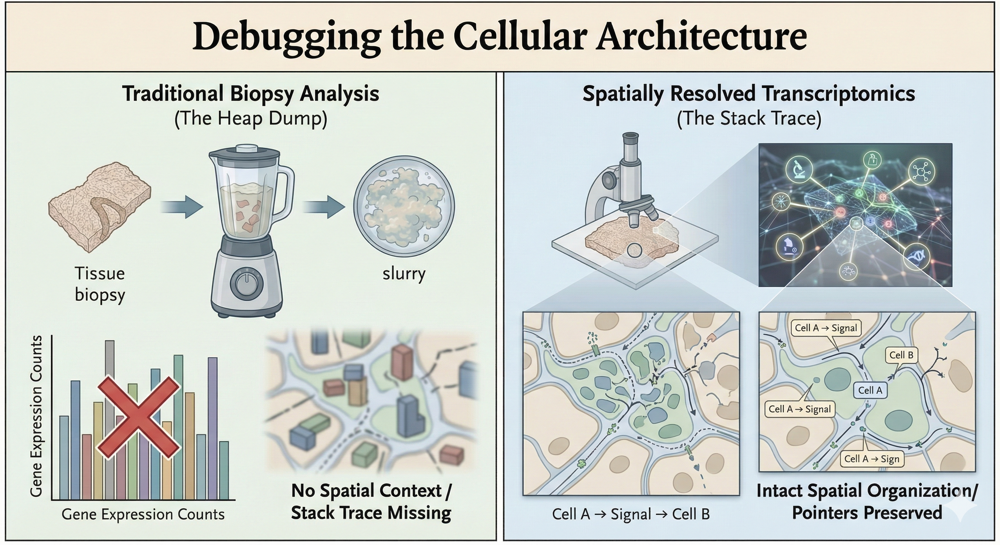
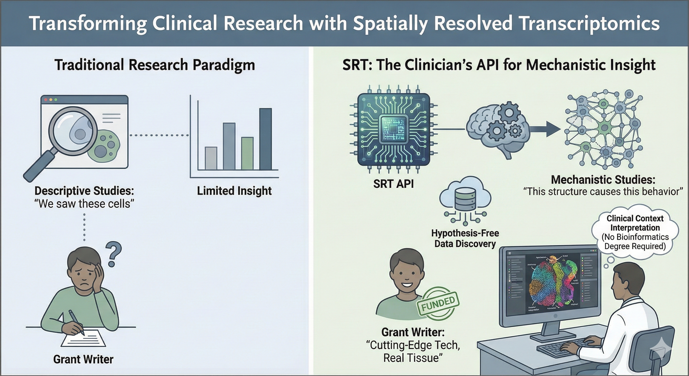

I’ve been spending some time recently looking at the state of clinical research, particularly how we try to understand disease at a molecular level. It turns out that for the last decade or so, the standard approach to investigating human biology has resembled analyzing a complex network without recording its relational architecture... we take a biopsy, grind it into a slurry, and sequence it. We get a perfect census of the parts, the gene expression counts, but we completely lose the pointers; we have no idea *where* those genes were expressed or who they were talking to. It’s like trying to understand a city by counting scattered bricks after demolition. While the raw materials are fully accounted for, the structural layout, pathways, and functional connections that define the living system are entirely lost..

Spatially Resolved Transcriptomics (SRT) provides the methodological answer to this challenge, representing an intuitive yet transformative advancement in biomedical technology. Rather than relying on tissue homogenization, SRT runs the biochemistry *in situ*. It maps the gene expression directly onto the histology slide. For the clinicians out there who might feel a bit alienated by the abstract nature of "big data" genomics: this is actually bringing the science back to your home turf. Clinicians have always known that structure *is* function. A lymphocyte in a tumor is a different object instance than a lymphocyte in the stroma, even if they inherit from the same class. SRT basically validates your spatial intuition with hard data.

**The Unit Tests: Real World Applications**

When you start digging into the papers, the applications are pretty wild. It’s not just about making pretty heatmaps; it’s about resolving "unknown unknowns" in pathology.

1.  The Firewall in Oncology

In cancer research, we often see patients who should respond to immunotherapy (the logs show high T-cell counts) but don’t. It turns out, this is a topology problem. SRT reveals "immune exclusion zones"—basically a physical firewall built by stromal cells that keeps the T-cells out of the tumor nest. It’s a mechanism you simply can’t see if you homogenize the tissue. We can now visualize the specific ligand-receptor handshakes at the border that enforce this security policy.

2.  The Spaghetti Code of Fibrosis

In Crohn’s disease, fibrosis is a major issue. We used to think it was just generic scarring. But recent work used SRT to identify a specific subclass of fibroblasts (CTHRC1+) that are "mechanosensitive." They hang out exactly where the creeping fat meets the muscle wall. It’s a specific, localized interaction driving the pathology—a "niche"—rather than a systemic failure. This is huge because it suggests we can target just that interaction rather than deprecating the whole immune system.

3.  The Network Topology of Autoimmunity

In Lupus, the spleen’s architecture—the white pulp and red pulp—starts to degrade. Researchers using CODEX (a protein-based cousin of SRT) found that the disease isn’t just about having "bad" antibodies; it’s about a collapse of the cellular social network. Plasma cells migrate into the wrong neighborhoods and start forming pathological connections with T-cells. The "first tier of neighbors" changes, and that changes the cell’s behavior. It’s a structural failure, not just a variable overflow.

4.  The Hidden Classes in Dermatology

Dermatology is fascinating because it’s so visual. Take Mycosis Fungoides (a T-cell lymphoma). It looks almost identical to eczema under a standard scope. But SRT shows that the malignant T-cells are doing something very specific: they build a high-entropy, exclusionary "neighborhood" that benign cells don’t. Similarly, in wound healing, we can now distinguish between "scarring" fibroblasts deep in the dermis and "regenerating" fibroblasts on the surface. It’s identifying the specific lineage responsible for the bug.

**The Bottom Line**

If you’re a clinician looking to do serious research, this is the method you want to be using. It moves you from descriptive studies ("we saw these cells/genes") to mechanistic ones ("this structure causes this behavior"). It generates hypothesis-free data, meaning you can discover mechanisms you didn't even know to look for. And frankly, it makes the grant writers happy because it’s cutting-edge tech applied to real human tissue. Sure, you will need some bioinformatics support to handle the computational pipeline, but you do not need to be a computational biologist to unlock the value of spatial transcriptomics. The heavy lifting happens behind the scenes; the real breakthrough comes from clinicians and researchers who know the biological questions and can interpret the spatial map.

**References**

1.  **Bauer-Rowe, K. E., et al. (2025).** "Creeping fat-derived mechanosensitive fibroblasts drive intestinal fibrosis in Crohn’s disease strictures." [*Cell*](https://doi.org/10.1016/j.cell.2025.08.029).

2.  **Belalov, I., et al. (2025).** "Spatial transcriptomics." [*Handbook of Translational Transcriptomics*](https://doi.org/10.1016/B978-0-443-19110-7.00003-3).

3.  **Squair, J. W., et al. (2021).** "Confronting false discoveries in single-cell differential expression." [*Nature Communications*](https://doi.org/10.1038/s41467-021-25960-2).

4.  **Goltsev, Y., et al. (2018).** "Deep Profiling of Mouse Splenic Architecture with CODEX Multiplexed Imaging." [*Cell*](https://doi.org/10.1016/j.cell.2018.07.010).

5.  **Liu, Y., et al. (2025).** "Spatial transcriptomics of progression gene signature and tumor microenvironment leading to progression in mycosis fungoides." [*Blood Advances*](https://doi.org/10.1182/bloodadvances.2024014495).

6.  **Sarkar, S., et al. (2024).** "Spatial cell graph analysis reveals skin tissue organization characteristic for cutaneous T cell lymphoma." [*npj Systems Biology and Applications*](https://www.nature.com/articles/s41540-024-00474-x).

7.  **Avenel, C., et al. (2025).** "Spatial tumor-immune ecosystems shape the efficacy of anti-PD1 immunotherapy in primary cutaneous melanoma." [*bioRxiv*](https://www.biorxiv.org/content/10.1101/2025.07.07.661465v1).

8.  **Seiringer, P., et al. (2024).** "Spatial transcriptomics reveals altered lipid metabolism and inflammation-related gene expression of sebaceous glands in psoriasis and atopic dermatitis." [*Frontiers in Immunology*](https://www.frontiersin.org/journals/immunology/articles/10.3389/fimmu.2024.1334844/full).

9.  **Foster, D. S., et al. (2021).** "Integrated spatial multiomics reveals fibroblast fate during tissue repair." \[*Proceedings of the National Academy of Sciences*(https://www.pnas.org/doi/10.1073/pnas.2110025118)\].