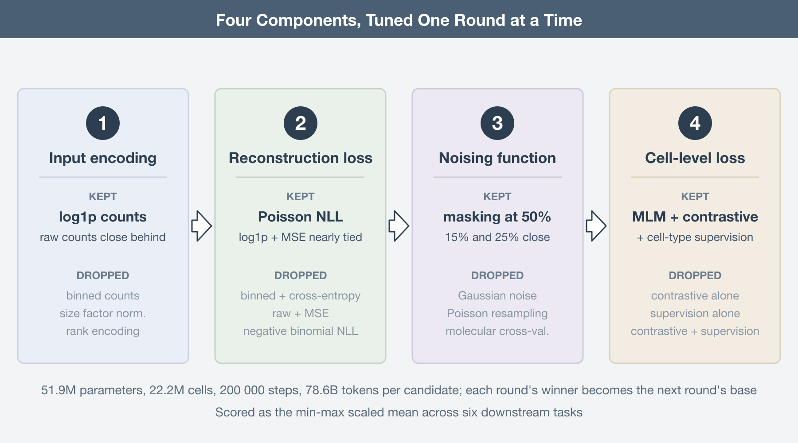
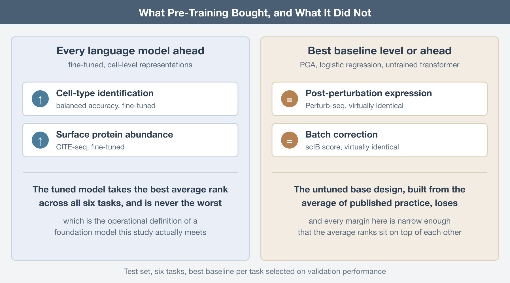

Someone in your group has already asked whether the lab should be fine-tuning scGPT instead of writing another Scanpy pipeline. It is a reasonable question. The pitch for single-cell foundation models is the pitch that worked for natural language: pre-train one large transformer on tens of millions of cells, adapt it to whatever comes next, and stop building a bespoke model for every task. The pitch has aged badly. Zero-shot evaluations found __scGPT__ and __Geneformer__ losing to simpler methods on tasks they were supposed to own (Kedzierska, Genome Biology, 2025), and five foundation models plus two other deep learning models failed to beat deliberately simple linear baselines at predicting perturbation responses (Ahlmann-Eltze, Nature Methods, 2025).

_What nobody could say was why_. Every published single-cell language model differs from every other in a dozen ways at once: how counts enter the model, what the reconstruction loss assumes about them, how inputs are corrupted, what the cell-level token is trained to do. When scGPT and Geneformer disagree on a benchmark, you cannot attribute the gap to any one of those decisions.

De Waele and colleagues took the obvious next step and stopped benchmarking the products (De Waele, NAR Genomics and Bioinformatics, 2026). They reimplemented the design idiosyncrasies as interchangeable parts, then benchmarked the parts. The framework is on PyPI as `bento-sc`, which means the experiments are repeatable rather than merely reported.

## One knob at a time, at language model scale

The base design is an encoder-only bidirectional transformer with 51.9M learnable weights, pre-trained by masked language modeling. Only nonzero counts enter the model, capped at the 1024 highest-count genes per cell, with FlashAttention doing the heavy lifting. Pre-training runs on scTab (Fischer, Nature Communications, 2024), a reproducibly split CELLxGENE census of 22.2 million human cells and 19,331 protein-coding genes, of which 15.2M cells are training data. Every model gets 200,000 steps at a batch size of 384, which works out to 78.6 billion pre-training tokens, of which 11.8B actually carry training signal.

Then the tuning. Four components get varied in sequence: the count embedding function, the reconstruction loss, the noising function, and the loss applied to the cell-level summary token. Within each round, every candidate is pre-trained from scratch and evaluated; the winner is carried into the next round. This is greedy hyperparameter optimization at a scale where nothing else is affordable, and it comes with the usual caveat, which the authors state plainly: interactions between components are never explored. A count encoding that loses under a cross-entropy loss might have won under a Poisson one.

Evaluation is six downstream tasks, deliberately spread across the axes that matter: expression upscaling, gene regulatory network inference, post-perturbation expression prediction, cell-type identification, surface protein abundance prediction, and batch correction. Three run zero-shot on the frozen representations, three involve fine-tuning. Three read gene-level embeddings, three read the cell-level token. Scores are min-max scaled within each experiment before averaging, so a task with a naturally wide numeric range does not quietly dominate the ranking.

## The counts want to be left alone

The first round compares six ways of getting an expression value into the model. The base design bins counts the way scGPT does (Cui, Nature Methods, 2024), with bin edges placed so each holds at least 0.2% of counts. Note that exact equal-frequency binning is impossible here; a bin containing only counts of one would swallow roughly 57% of all counts in scTab. The alternatives are rank encoding in the style of Geneformer (Theodoris, Nature, 2023), raw counts, size-factor normalization, log1p, and size-factor normalization followed by log1p.

Log1p and raw counts win. Binning follows closely. Size-factor normalization hurts. Rank encoding finishes last, and the authors check whether that is an artifact of asking a rank-encoded model to predict binned counts: they retrain it once with ranks at the output, and once masking gene identities and predicting which gene occupied a rank, which is close to Geneformer's actual setup. Both alternatives perform worse than binned outputs.

There is an echo here worth naming. Benchmarking four families of transformation on ordinary single-cell data, Ahlmann-Eltze and Huber found that the logarithm with a pseudocount followed by PCA matched or beat the theoretically appealing alternatives (Ahlmann-Eltze, Nature Methods, 2023). Different architecture, same result: the preprocessing that does least does best. The one addition that helped was pseudoquantization, a stabilization layer after the count embedding that keeps unusually large values from destabilizing training.

## Loss functions that know what a count is

Round two changes what the model predicts and how it is scored, which amounts to changing the assumed count distribution. Predicting a bin under multiclass cross-entropy is the base. The alternatives predict scalars: raw counts under mean squared error, Poisson negative log-likelihood, or negative binomial negative log-likelihood, and log1p counts under mean squared error.

Poisson wins by a small margin, with log1p plus MSE essentially tied behind it. So encoding what you know about count data into the loss pays, with one loud exception: negative binomial NLL is the worst of everything tested. The likely culprit is numerical. Because zeros are excluded from the input, both Poisson and negative binomial have to be modeled in zero-truncated form, and the truncated negative binomial likelihood is the fragile one. Worth noting that no prior single-cell transformer had tried Poisson NLL for pre-training, so the current best option in this round is one nobody had used.

## Masking survives everything thrown at it

Round three attacks masking itself. Rates of 15%, 25%, and 50% are compared, along with three corruption schemes that are not masking at all: Gaussian noise added to log1p counts, resampling counts from a Poisson with the observed count as its mean, and molecular cross-validation, which splits each count into an input fraction and a target fraction. The last three share a structural advantage over masking; they provide training signal on every gene in the profile rather than only the masked subset.

They lose anyway. Masking wins, and at 50%, the most aggressive rate tested. The detail that should make you uncomfortable is in the loss curves: reconstruction validation loss is essentially identical across all three masking rates. Hiding half the observed transcriptome costs the model nothing it can measure. Either expression profiles are redundant enough that the remaining genes fully determine the hidden ones, or the reconstruction task is too easy to be a useful proxy for anything downstream. Both readings are bad news for masked language modeling as a pre-training objective, and neither has been chased down.

## Three pre-training tasks beat one

The last round questions masked language modeling entirely. Two alternatives operate on the cell summary token: contrastive learning, which masks the same cell twice and pulls the two views together while pushing other cells away, and plain supervised cell-type classification, which is available at scale because scTab is labeled. All combinations get tested, since none of the three losses exclude the others.

Contrastive-only and supervised-only models are worse. The top three all include masked language modeling, and the best model uses all three losses at once. The complementarity is visible task by task. Only models that include supervised cell-type pre-training clear 0.70 on the scIB batch correction score, which makes sense given that separating cell types into clusters is part of what scIB measures. Without masked language modeling in the mix, the model cannot do zero-shot expression upscaling at all, because nothing ever taught it to produce a count.

The rule the authors extract is that pre-training must carry signal relevant to every task you intend to run. Read that again in the context of the foundation model pitch, which is that pre-training generalizes to tasks you did not anticipate.

## Where the baselines are still standing

Test set results are where the argument lands. Each round's winner is scored against the best baseline per task, with baselines drawn from current best practice and kept deliberately simple: principal component analysis, logistic regression, untrained transformers.

Not every tuning round improved test performance. Tuning frequently bought a better average by sacrificing one task, and no single language model is best across all six. The final configuration is the best performer overall by both min-max scaled average and average rank, and it is never the worst on any task, which is the honest operational definition of a foundation model and the one thing the tuning clearly delivered.

The baselines remain competitive on average. For cell-type identification and surface protein abundance prediction, every language model in the lineup beats the best baseline. For post-perturbation expression prediction and batch correction, the best baseline is virtually identical to the best language model. And the untuned base design, the one built from the average of published practice, loses to the baselines on average. All of these margins are narrow, which is exactly the point; the average ranks sit close together because nothing in this comparison separates cleanly.

The authors put forward a specific hypothesis for the missing transfer. Pre-training happens on scTab, which is 10X data only. The downstream evaluations include CITE-seq and Perturb-seq. A model trained on scTab and evaluated on non-10X data has been shown to fall from roughly 0.8 macro F1 to roughly 0.4. From the model's perspective, half the benchmark is out of distribution, and no amount of pre-training scale fixes a corpus that does not cover the manifold.

Two closing experiments point at cheap wins. Raising the gene token cap from 1024 to 2048 produces small but consistent gains on precisely the tasks that need a detailed view of a cell: post-perturbation prediction, surface protein abundance, and network inference. And concatenating a learned embedding of the dataset and donor pair to the gene embeddings, then zeroing it at evaluation time, improves everything except cell-type identification, with the largest gain on batch correction. Both suggest the current designs are leaving performance on the table for reasons that have nothing to do with scale.

## What to do with this

If you are building one of these, the recipe is now written down. Feed log1p or raw counts and skip size-factor normalization. Put your distributional knowledge in the loss rather than the input, with Poisson as the current best option and negative binomial as the one to avoid under zero truncation. Mask, and mask hard. Combine pre-training objectives so that each downstream task family has something in the pre-training signal that speaks to it. Do not cap gene tokens tighter than your compute forces you to, and add a batch token.

If you are consuming rather than building, the advice is shorter. Run the boring baseline first. PCA and logistic regression take minutes, and on four of six tasks here they were either ahead or level with a transformer that consumed 78.6 billion tokens.

_The design choices that improve a single-cell language model most are the ones that interfere with the counts least, and even the tuned best of them does not yet clear a well-chosen linear baseline by a margin that would change a conclusion you were going to draw._

None of this makes single-cell transformers a dead end. It makes them an architecture in the phase where the interesting work is unglamorous: better pre-training corpora that span more than one chemistry, objectives whose difficulty scales with the model, and some account of what those attention maps over genes actually encode. The generational leap has not happened. It was announced early, which is a different thing.

------------------------------------------------------------------------

## Further Reading

**The study:**

-   De Waele G, Menschaert G, Waegeman W. A systematic assessment of single-cell language model configurations. *NAR Genomics and Bioinformatics* 2026. https://doi.org/10.1093/nargab/lqag095

**The models being taken apart:**

-   Cui H, et al. scGPT: toward building a foundation model for single-cell multi-omics using generative AI. *Nature Methods* 2024. https://doi.org/10.1038/s41592-024-02201-0

-   Theodoris CV, et al. Transfer learning enables predictions in network biology. *Nature* 2023. https://doi.org/10.1038/s41586-023-06139-9

**The pre-training corpus:**

-   Fischer F, et al. scTab: scaling cross-tissue single-cell annotation models. *Nature Communications* 2024. https://doi.org/10.1038/s41467-024-51059-5

**On baselines that refuse to lose:**

-   Kedzierska KZ, et al. Zero-shot evaluation reveals limitations of single-cell foundation models. *Genome Biology* 2025. https://doi.org/10.1186/s13059-025-03574-x

-   Ahlmann-Eltze C, Huber W, Anders S. Deep-learning-based gene perturbation effect prediction does not yet outperform simple linear baselines. *Nature Methods* 2025. https://doi.org/10.1038/s41592-025-02772-6

-   Ahlmann-Eltze C, Huber W. Comparison of transformations for single-cell RNA-seq data. *Nature Methods* 2023. https://doi.org/10.1038/s41592-023-01814-1
