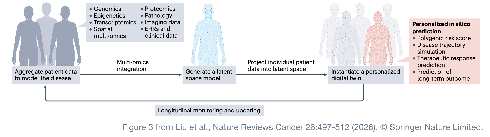
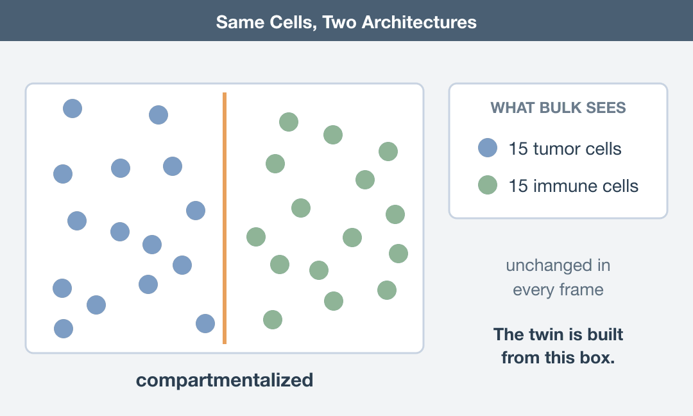
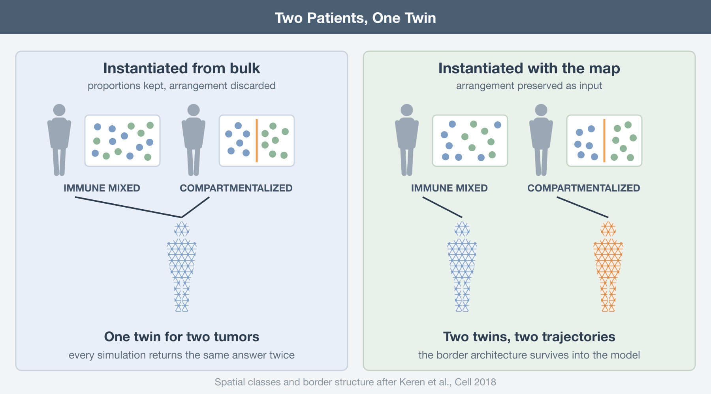
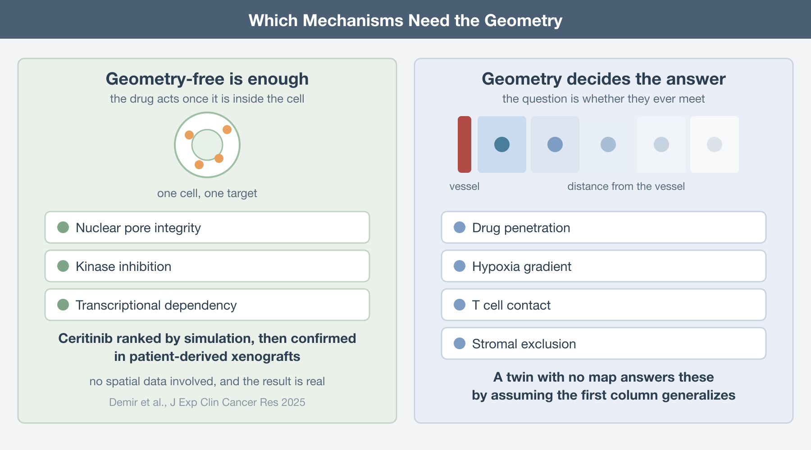
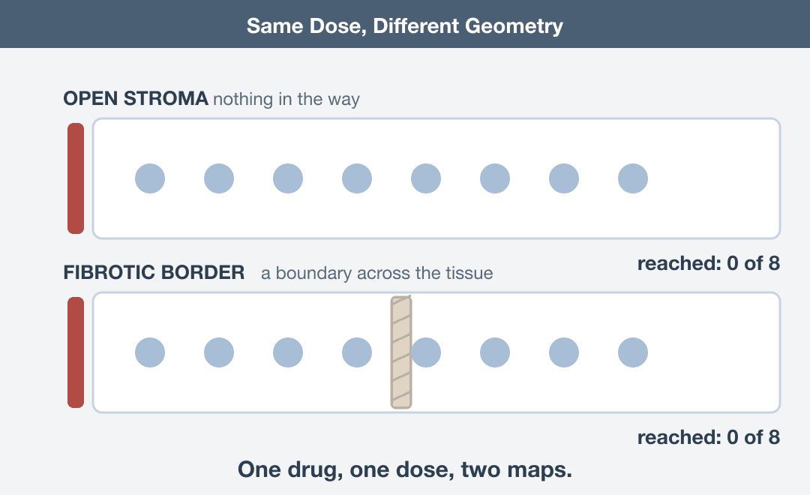
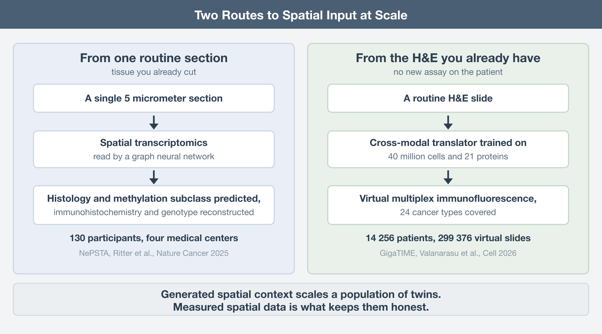
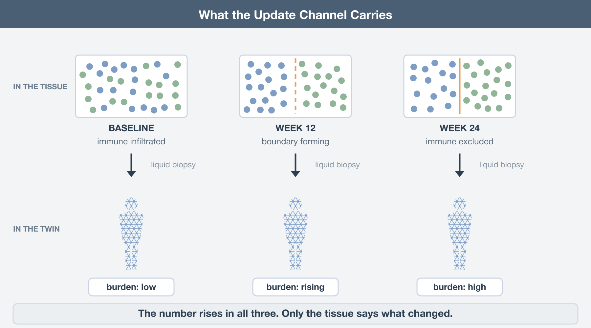

The idea behind an oncology digital twin is one of the most compelling in translational medicine. Build a computational version of an individual patient’s cancer, test treatments on that virtual model, and use the results to decide what should be tested in the patient. In principle, it is a way of running part of the experiment before exposing the person to the treatment.

A recent review by Liu and colleagues on AI-driven multi-omics integration in cancer lays out how such a system might actually be built (Liu, *Nature Reviews Cancer*, 2026). Importantly, this is not science fiction. Several of the components already exist, and there are early proof-of-concept studies showing that computational models can identify treatments that would not otherwise have been obvious, with subsequent experiments supporting those predictions.

But when I looked closely at the proposed architecture, one thing stood out.

Spatial multi-omics is included among the possible inputs, alongside genomics, transcriptomics, proteomics and other data types. In the schematic, however, spatial information appears essentially as another modality on the list. The framework that follows does not appear to treat it as essential. In fact, the model is explicitly designed to work when some modalities are missing, using the available data to infer what was not measured.

That flexibility is obviously useful. Real clinical datasets will rarely contain every possible layer of information.

But it also raises a more fundamental question: **can a meaningful digital twin of a tumour be built if we do not know where its cells are?**

A tumour is not simply a collection of cancer cells plus immune cells plus fibroblasts plus blood vessels. Their spatial organisation matters. A T cell separated from a tumour cell by a few micrometres is biologically different from the same T cell trapped behind a stromal barrier. A macrophage at the invasive margin may behave differently from one sitting in a necrotic core. Two tumours with very similar cell-type proportions and gene-expression profiles can therefore behave very differently if those cells are arranged differently.

In other words, geometry is not just another molecular measurement. It is part of the biological system itself.

Before going further, two things are worth making clear:

First, the Liu review is excellent. This is not a criticism of the paper as a whole. It is one of the most comprehensive treatments of AI-driven multi-omics integration in oncology I have read recently. It is unusually specific about what is already possible, what has been demonstrated experimentally, and what remains aspirational. The digital-twin discussion is only one part of a much broader and very useful review.

Second, the argument I am making here is mine, not theirs. Liu and colleagues do not claim that spatially resolved data are required to build a cancer digital twin. Nor do they argue that spatial information is unimportant.

My concern is slightly different.

If spatial organisation is treated as an optional input, then a digital twin built without geometry may be computationally complete while still being biologically incomplete. And if the goal is eventually to predict how an individual tumour will respond to therapy, that distinction may turn out to matter a great deal.

## How the twin actually gets built

The framework runs in three stages, and the review is admirably concrete about each.

First, a general representation. You aggregate high-dimensional multi-omics data from thousands of patients and train a deep learning model on the whole cohort until it compresses that complexity into a latent space, a lower-dimensional map of the disease landscape. The proof that this scales is LifeClock, which digested millions of longitudinal electronic health records into a biological clock that predicts health risks across the human lifespan. The principle is old and sound: learn the general rules from the population, then use them to describe an individual.

Second, instantiation. You take one patient's data, which may be genomic, imaging, histopathological, clinical, or some incomplete subset of those, and project it into that pre-trained latent space. The patient gets a coordinate. That coordinate is their deep phenotype, and the review says it should ideally capture patient-specific states such as the tumor's immune activation level or its metabolic profile. Crucially, the projection tolerates missing modalities; the model leans on population structure to infer what it was not given, for example predicting molecular states from histology.

Third, simulation. Because the twin is a functional model rather than a filing cabinet, you can perturb it. Mechanistic models of tumor growth and drug response run inside it, and clinicians compare therapeutic strategies in silico before committing to one. The whole thing sits in a feedback loop; new data from the patient's ongoing course recalibrates the twin so it tracks their biology over time (Laubenbacher, Nature Computational Science, 2024). The review's own schematic of the three stages is worth reproducing whole, because the list of accepted inputs is right there in the first box.

## The coordinate is doing more work than it can carry

Stage two is where my objection lands, and it lands on a specific sentence in the review: the deep phenotype should capture the tumor's immune activation level.

Immune activation is not a scalar property of a tumor. It is an arrangement. Keren and colleagues made this unmissable eight years ago, imaging 36 proteins at subcellular resolution across 41 triple-negative breast cancers with MIBI-TOF (Keren, *Cell*, 2018). The tumors sorted into two spatial classes: immune mixed, where immune cells interleave with tumor cells, and compartmentalized, where the two populations occupy separate territories with an ordered structure along the border. That border architecture was associated with survival. PD1, PD-L1, and IDO expression tracked cell type and location together, not cell type alone.

Now put two of those patients through stage two. Same immune infiltration by proportion, same checkpoint transcripts by bulk measurement, different arrangement, different outcome. Projected from bulk input, they land on the same coordinate. The twin cannot separate them because the separating information was destroyed before the model ever saw the sample. Every simulation you subsequently run from that coordinate returns one answer for two patients whose tumors are behaving differently, and it returns it with the same confidence either way.

This is not a subtle degradation. It is a degenerate coordinate, and degeneracy in a latent space does not announce itself. The model will happily place a patient, report a deep phenotype, and produce a trajectory. Nothing in the output says "two distinct biologies collapsed here".

## Why one successful twin does not make geometry dispensable

There is, however, an important exception already highlighted in the review. Demir and colleagues built digital twins of patients with high-risk pediatric liver tumors by integrating clinical, genetic, and transcriptomic data and then running iterative in silico drug-response simulations on mechanistic models (Demir, *Journal of Experimental & Clinical Cancer Research*, 2025). The simulations ranked ceritinib above other ALK inhibitors. In patient-derived xenografts the prediction held up: ceritinib suppressed nucleoporin expression, disrupted nuclear membrane integrity, reduced tumor burden, and extended survival. *No spatial data was involved, and the result is real*.

Look at what kind of mechanism that is, though. Nuclear pore integrity is cell-intrinsic. Whether a drug wrecks a nuclear pore complex depends on the drug meeting the cell, not on where the cell was sitting. For that class of question, a geometry-free twin is adequate, and pretending otherwise would be dishonest.

The trouble starts the moment the mechanism involves delivery, contact, or exclusion. Drug penetration falls off with distance from a vessel. Hypoxia is a gradient, not a level. A T cell kills what it can touch. Stromal exclusion is defined entirely by a boundary. Ask a geometry-free twin whether a checkpoint inhibitor will work and it can tell you what the drug does to a cell; it cannot tell you whether the drug and the cell ever meet. Those are different questions, and current twins answer the second one by silently assuming the answer to the first generalizes.

## Spatial data are becoming clinically feasible

The obvious objection is cost. Spatial assays are expensive, tissue is scarce, and a twin that requires Xenium on every patient is a twin nobody builds. That objection was stronger two years ago than it is now.

**Spatial transcriptomics on routine sections** already produces twin-grade input. NePSTA runs spatial transcriptomics with graph neural networks on single five-micrometer sections, and across 130 participants at four medical centers it predicted tissue histology and methylation-based subclasses, then reconstructed immunohistochemistry and genotype profiles from tissue that was inadequate for conventional molecular diagnostics (Ritter, *Nature Cancer*, 2025). That is one section of the block, not a research protocol bolted onto the clinic.

**Generative bridges from histology** scale the coverage. GigaTIME learns a cross-modal translator from 40 million cells with paired H&E and multiplex immunofluorescence across 21 proteins, then generates virtual multiplex slides from plain H&E. Applied across 14,256 patients from 51 hospitals, it produced 299,376 virtual slides spanning 24 cancer types and surfaced 1,234 significant associations, with independent corroboration in 10,200 TCGA patients (Valanarasu, *Cell*, 2026). This is exactly the "infer the missing modality" move the twin framework depends on, and it works.

But inference is not a substitute for spatial ground truth. Models that reconstruct spatial proteomics from morphology can extend spatial information to far more patients, but what they can recover is ultimately constrained by the spatial assays on which they were trained. They will capture some features extremely well and miss others systematically. The practical solution is therefore not to choose between direct spatial profiling and generative inference, but to combine them: use measured spatial data to anchor the system, and use generative models to propagate that information at scale. This is also why [graph neural networks](https://en.wikipedia.org/wiki/Graph_neural_network) have become so important in spatial omics. They do not treat a tumor as a collection of independent measurements, they represent it as a network of cells whose position, neighborhood, and interactions are part of the biology the model is trying to reproduce.

## The feedback loop loses the spatial map

Even if a digital twin starts with a spatially resolved baseline, that information becomes much harder to preserve as the patient is followed over time. A twin is supposed to be recalibrated as the patient's course unfolds, and nobody is re-biopsying a tumor every six weeks. The practical monitoring channel is liquid biopsy, and the review states the limitation plainly: liquid biopsy alone lacks spatial information about the tumor microenvironment.

So even a twin instantiated with a proper spatial baseline gets updated through a spatially blind channel. Rising circulating tumor DNA tells you burden is up. It does not tell you whether the immune compartment collapsed, whether a fibrotic boundary hardened, or whether a resistant clone expanded at the invasive front. Those have different implications and, in a mechanistic model, different downstream simulations. A baseline spatial map is what lets you interpret a scalar update as a change in a structure rather than a change in a number.

## What to do about it

If you are designing a twin study, spend one section of the block on a spatial assay and record where the cells were. Treat the spatial baseline as instantiation data, not as a validation afterthought.

Test your latent space for degeneracy directly: take pairs of patients who landed on nearby coordinates and check whether their tissue architecture actually matches. If it does not, the coordinate is not a deep phenotype, it is an average.

Keep at least one real spatial measurement in any pipeline that infers spatial features generatively, and be explicit about which simulated mechanisms depend on geometry. Cell-intrinsic drug action can be simulated without it. Delivery, contact, and exclusion cannot.

*A twin instantiated from data that discarded the geometry is not a replica of the patient; it is a replica of the patient's homogenate, and it will answer every question about delivery, immune contact, and exclusion with the same confident wrong answer.*

The digital twin is the right ambition, and this review makes the best case for it I have read: the three stages are the right three stages, and the honesty about what has and has not been shown is rarer than it should be. The gap is narrow and specific. Spatial data is listed as an input and then never made load-bearing, in a framework whose central promise is a coordinate that captures immune activation. Close that gap and the rest of the architecture stands. Leave it open and a replica is only as good as what it replicates; build one from a parts list and you get a very sophisticated model of a tumor that has already been dissolved.

------------------------------------------------------------------------

## Further Reading

**The review this post responds to:**

- Liu F, Beck S, Yang L, Luo H, Zhang K. Advancing AI for multi-omics and clinical data integration in basic and translational cancer research. *Nature Reviews Cancer* 2026. https://doi.org/10.1038/s41568-026-00922-2

**On digital twins:**

- Laubenbacher R, Mehrad B, Shmulevich I, Trayanova N. Digital twins in medicine. *Nature Computational Science* 2024. https://doi.org/10.1038/s43588-024-00607-6

- Demir S, et al. Mechanistic models position ceritinib as a nuclear integrity disrupting therapy in pediatric liver tumors. *Journal of Experimental and Clinical Cancer Research* 2025. https://doi.org/10.1186/s13046-025-03535-z

**On why the arrangement is the phenotype:**

- Keren L, et al. A structured tumor-immune microenvironment in triple negative breast cancer revealed by multiplexed ion beam imaging. *Cell* 2018. https://doi.org/10.1016/j.cell.2018.08.039

**On getting spatial input into the pipeline:**

- Ritter M, et al. Spatially resolved transcriptomics and graph-based deep learning improve accuracy of routine CNS tumor diagnostics. *Nature Cancer* 2025. https://doi.org/10.1038/s43018-024-00904-z

- Valanarasu JMJ, et al. Multimodal AI generates virtual population for tumor microenvironment modeling. *Cell* 2026. https://doi.org/10.1016/j.cell.2025.11.016