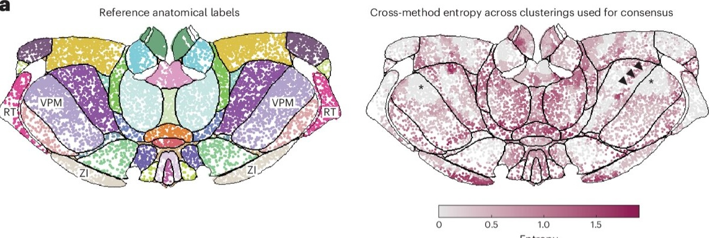
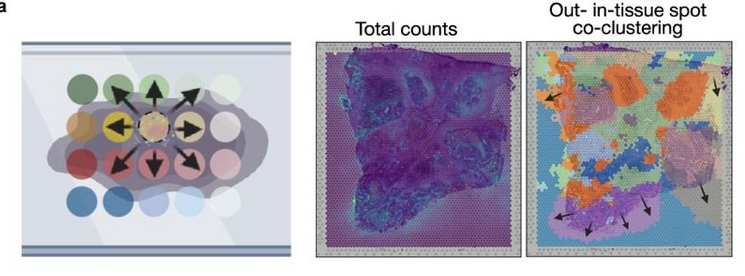
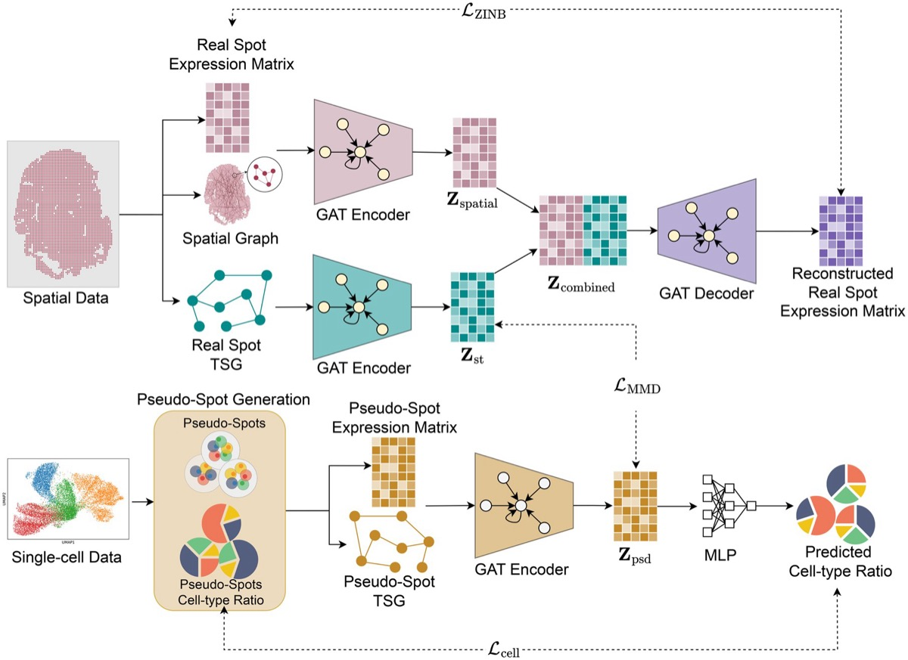
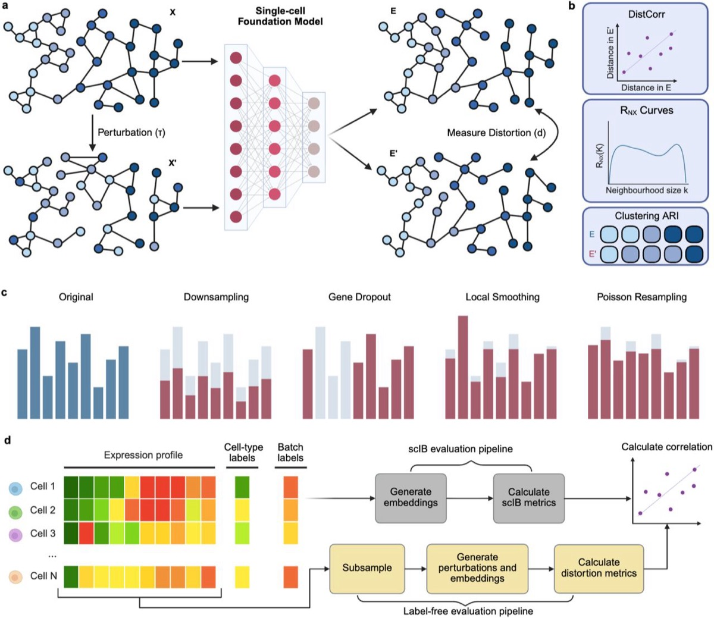
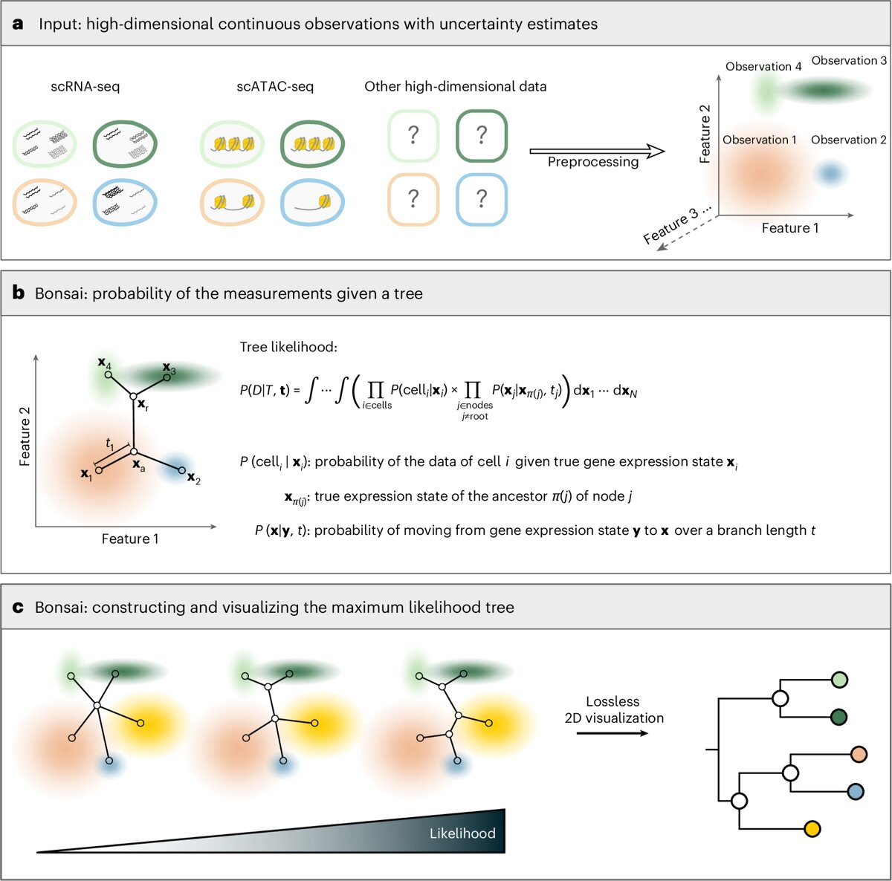
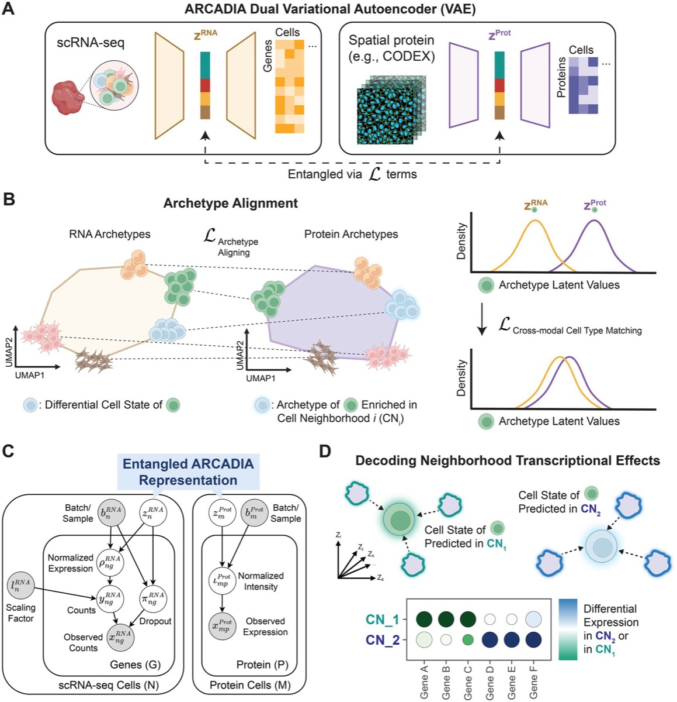

This week belongs to benchmark criticism. In Nature Methods, Sun and colleagues argue that the benchmarks used to rank spatially aware clustering methods are built on ground truth that will not hold weight, because manual anatomical annotations are biased.

Four other items this week make the same structural point in different fields, that clean-data performance and downstream-task scores do not measure what practitioners assume they measure.

## Spatial biology

### [Beyond benchmarking: an expert-guided consensus approach to spatially aware clustering](https://doi.org/10.1038/s41592-026-03194-8)

Source: [Nature Methods](https://www.nature.com/nmeth/)

Jieran Sun and colleagues, with Naveed Ishaque as senior author, show that existing benchmarks of spatially aware clustering are narrow and poorly grounded. They are dominated by Visium and brain tissue, and they treat manual anatomical annotation as truth when those labels carry known bias.

The authors release SACCELERATOR, an extensible framework that standardises data formatting, method integration and metric evaluation, and use it to demonstrate poor generalisability across methods. Rather than publish another ranking they propose a consensus workflow that uses spatial entropy to flag regions where methods disagree and routes only those to expert review. A companion Research Briefing, ["Benchmark pitfalls expose need for expert-guided spatial clustering"](https://doi.org/10.1038/s41592-026-03193-9), appeared the same day.

Why it matters: this is the strongest available argument that a reader should stop asking which spatial clustering method wins and start asking where the methods disagree.

### [CLEAR-ST: Physics-informed probabilistic decontamination of spatial transcriptomics by modeling mRNA lateral diffusion](https://www.biorxiv.org/content/10.64898/2026.08.13.744615v1)

Source: [bioRxiv](https://www.biorxiv.org/)

K. Ma, Y. Huang and Joshua W. K. Ho characterise mRNA lateral diffusion in sequencing-based spatial platforms, where transcripts from one spot bind probes in another. They first document the artefact empirically by comparing 10x reference Visium samples against independently generated ones, showing that out-of-tissue counts track nearby in-tissue expression, concentrate at tissue boundaries, and carry coherent directional bias across genes. CLEAR-ST then infers a clean latent expression field with a denoising autoencoder coupled to a graph-Laplacian forward contamination model with learnable diffusion parameters. Correction improved spatial domain recovery and raised gene-level spatial autocorrelation across samples of differing contamination burden.

Why it matters: the empirical characterisation is more useful than the model, because it gives readers a diagnostic they can run on their own Visium slides before trusting any boundary-adjacent finding.

### [STcompare: comparative spatial transcriptomics data analysis of structurally matched tissues to characterize differentially spatially patterned genes](https://doi.org/10.1093/bioinformatics/btag644)

Source: [Bioinformatics, Oxford](https://academic.oup.com/bioinformatics)

Kalen Clifton and colleagues from Jean Fan's lab observe that current comparative spatial methods conflate two different questions. Methods adapted from non-spatial data capture only magnitude change, and spatial variability methods capture only change in the significance of spatial variation. STcompare instead tests for differences in spatial correlation and spatial fold change across structurally matched locations. Simulations show it controls false positives even under the spatial autocorrelation endemic to this data, and mouse brain replicates confirm high cross-sample spatial correspondence before the method is applied to condition-driven comparisons.

Why it matters: readers running case versus control spatial experiments almost always reach for pseudobulk differential expression, and this paper names precisely what that choice throws away.

### [Benchmarking the robustness of segmentation models to corruptions in biological imaging](https://www.biorxiv.org/content/10.64898/2026.08.21.746302v1)

Source: [bioRxiv](https://www.biorxiv.org/)

Y. Kesenci, L. Le Folgoc and E. Angelini simulate 36 corruption types at varying severity across images from 30 datasets, then measure how deep learning segmentation models degrade. Clean-image performance does not predict robustness. StarDist, a method roughly a decade old, proves more robust than several newer foundation-model competitors. A representation analysis locates the failure in the early layers of the encoder rather than in the decoder or the head.

Why it matters: segmentation error propagates into every downstream cell-level statistic in Xenium and CosMx work, so a benchmark showing that the newest model is not the safest choice speaks directly to all imaging-based spatial users.

### [SPIDER improves spatial transcriptomics data using single-cell RNA sequencing](https://www.rna-seqblog.com/spider-improves-spatial-transcriptomics-data-using-single-cell-rna-sequencing/)

Source: [RNA-Seq Blog](https://www.rna-seqblog.com/)

SPIDER, from the University of Central Florida, denoises spatial transcriptomics by borrowing structure from annotated single-cell reference data. It builds three graphs, one for spatial proximity, one for expression similarity in the observed data, and one for simulated spatial measurements, then uses graph-based deep learning to transfer patterns onto noisy spots. On brain and breast cancer tissue it recovered known architecture and improved clustering against comparators. The authors concede a dependency on reference quality and a heavy compute cost, but the output stays at gene level rather than collapsing into an opaque embedding.

Why it matters: reference-guided denoising imports the reference's biases along with its signal, which is the obvious critical question and one no coverage of this tool has yet asked out loud.

## Single-cell methods and benchmarking

### [On the illusion of scRNA-seq batch effect correction](https://www.biorxiv.org/content/10.1101/2025.05.12.653389v2)

Source: [bioRxiv](https://www.biorxiv.org/)

F. Codice, P. Fariselli and D. Raimondi use a machine learning probing technique, formalised as the Batch Probing Score, across six datasets. After correction by the most popular tools, batch of origin remains clearly predictable from the corrected data. The standard unsupervised evaluation metrics used to validate those correctors lack the sensitivity to detect this residual signal, while a supervised classifier finds it easily. The authors argue downstream analysis tools can pick up the same residual signal, and propose probing-based metrics as a new standard.

Why it matters: almost every reader's pipeline runs Harmony or scVI and then reports a kBET or LISI score, and this paper says that combination cannot detect its own failure.

### [Robustness to nuisance perturbations enables unsupervised evaluation of single-cell foundation models](https://www.biorxiv.org/content/10.64898/2026.08.22.746357v1)

Source: [bioRxiv](https://www.biorxiv.org/)

A. Sallam and Jesse Gillis note that single-cell foundation model evaluation rests almost entirely on downstream tasks, which measure whether an embedding recovers annotated labels but never whether that structure is reproducible. They propose an unsupervised criterion instead, that a faithful representation should preserve neighbourhood structure under nuisance perturbations mimicking technical and sampling variation. Across five foundation models, a PCA baseline and 39 datasets, models ranked as near-equivalent by standard benchmarks differ by nearly twofold in local neighbourhood preservation when just 5 percent of counts are discarded. The instability is frequently masked by embeddings that look visually coherent.

Why it matters: the finding that a visually clean UMAP can hide a twofold difference in stability is the most quotable single-cell result of the week.

### [Synthetic control enables reliable cluster validation and marker discovery in omics data](https://www.biorxiv.org/content/10.1101/2023.07.21.550107v3)

Source: [bioRxiv](https://www.biorxiv.org/)

Dongyuan Song, Jingyi Jessica Li and colleagues address the double-dipping problem in post-clustering differential analysis. Features that drove the clustering are inherently more likely to test as differential on the same data, which produces false-positive markers and can make a spurious cluster look like a real cell type or spatial domain. ClusterDE generates synthetic null data representing a single homogeneous group, then uses it as an in-silico negative control to control the false discovery rate regardless of clustering quality. Version three, posted 26 August, widens the scope from single-cell and spatial transcriptomics to multi-omics, population-scale bulk transcriptomics and microbiome data.

Why it matters: double dipping is the most common statistical error in the single-cell papers , and this version gives them a tool that covers bulk and microbiome work too.

### [scTimeBench: a streamlined benchmarking platform for single-cell time-series analysis](https://doi.org/10.1093/bioinformatics/btag414)

Source: [Bioinformatics, Oxford](https://academic.oup.com/bioinformatics)

Adrien Osakwe, Eric H. Huang and Yue Li assess time-aware trajectory inference on three axes, forecast accuracy at unseen time points, embedding coherence between original and projected data, and cell-type lineage fidelity. They test ten methods across eight datasets spanning four species. The important result is a dissociation, that several methods forecast accurately while failing to preserve biological signal in latent space or in lineage reconstruction, and most underperform a simple correlation baseline on lineage fidelity. Integrating pseudotime helped, by aligning snapshots to each cell's intrinsic clock rather than to wall-clock sampling time.

Why it matters: a method can be right about the numbers and wrong about the biology, and this is a clean worked example for readers who evaluate trajectory tools by prediction error alone.

### [Bonsai reconstructs tree representations for distortion-free visualization and exploration of high-dimensional data](https://www.rna-seqblog.com/bonsai-reconstructs-tree-representations-for-distortion-free-visualization-and-exploration-of-high-dimensional-data/)

Source: [RNA-Seq Blog](https://www.rna-seqblog.com/)

A group at the University of Basel argues that UMAP and t-SNE style projections distort the relationships they are used to interpret, and represents single-cell data as a tree instead. Distances along the branches are constructed to reflect relatedness in the original high-dimensional space. Applied to human blood data the method recovered known cell relationships and flagged an NK cell subtype arising from an unexpected lineage. The authors position it as general purpose across expression, chromatin, microbiology and neuroscience data.

Why it matters: the anti-UMAP argument is familiar, but a concrete alternative that produces a new biological claim is rarer and gives the critique something to stand on.

## Multi-omics integration

### [ARCADIA combines RNA sequencing and spatial proteomics to reveal how tissue location shapes cell behavior](https://www.rna-seqblog.com/arcadia-combines-rna-sequencing-and-spatial-proteomics-to-reveal-how-tissue-location-shapes-cell-behavior/)

Source: [RNA-Seq Blog](https://www.rna-seqblog.com/)

ARCADIA, from Columbia University, integrates single-cell RNA sequencing with spatial proteomics without requiring cell-to-cell matching between the modalities. It identifies representative cellular states, described as archetypes, within each dataset, then aligns those on biological composition. Applied to tonsil tissue it reconstructed known organization and mapped B-cell maturation and T-cell activation to distinct spatial compartments. The biological claim is that cells of nominally the same type behave differently according to location and neighbors.

Why it matters: dropping the cell-matching requirement removes the step that usually breaks when transcriptomic and proteomic assays come from serial sections rather than the same cells.

## Commentary 

### [Will AI cure all disease in 10 years?](https://www.youtube.com/watch?v=ukZvIjq2oJc)

Source: [OMGenomics](https://www.youtube.com/channel/UCG4kmWK8UyzfenZ60xVBapw)

Posted on 27 August, this video examines recent claims that AI could eliminate most disease within the next decade and compares them with the realities of drug development. It takes a historical perspective, revisiting Nixon's 1971 War on Cancer, the IBM Watson–MD Anderson oncology partnership launched in 2013 and shelved in 2017, and Microsoft's 2016 prediction that cancer could be solved within ten years. It then contrasts these earlier promises with more recent statements from Dario Amodei in August 2026, Demis Hassabis on *60 Minutes* in April 2025, and Eric Topol in August 2026. The video is primarily commentary and critical analysis rather than a technical tutorial.